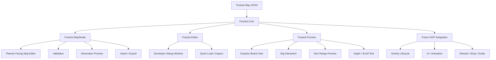
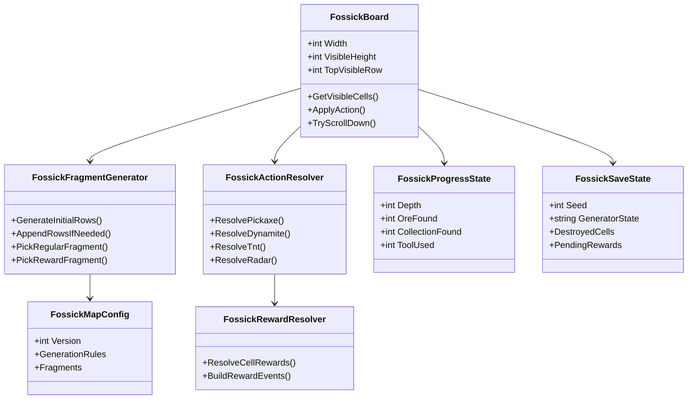
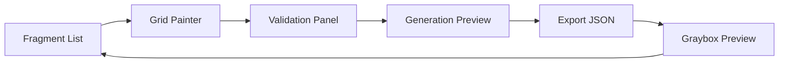
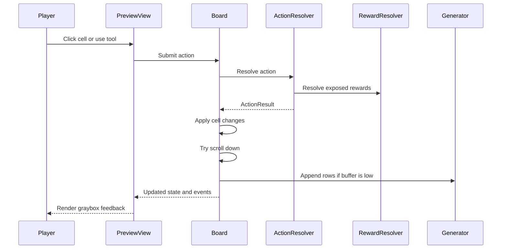

# Fossick 核心玩法开发方案

## 目标

Fossick 第一阶段的目标不是接入完整 HOP 活动，而是在独立 Unity 工程中验证核心玩法：

- 地图碎片能被稳定配置、校验、导入和导出。
- 矿井能按固定规则无限向下生成。
- 玩家能在默认 7x6 可视窗口中挖掘、露出、收集、使用道具、推进深度。
- 每次操作由纯逻辑产出结果，表现层只负责播放和渲染。
- 随机种子和保存状态能保证重进后地图、纹理、奖励位置不变化。

这份方案只覆盖前期玩法核心和工具链，不展开 HOP 主工程中的活动生命周期、商店、促销、弹板、埋点和正式美术包装。

## 工程分层



建议先把代码拆成四个 assembly：

- `Fossick.Core`：纯玩法逻辑，不依赖 Unity UI。
- `Fossick.MapStudio`：面向策划的运行时地图编辑器，可在 Unity 中运行，也可打包成桌面应用。
- `Fossick.Editor`：Unity EditorWindow，仅作为程序开发调试入口，不作为正式策划工具。
- `Fossick.Preview`：运行时灰盒验证器，服务手感和规则验证。

编辑器形态的优先级应是：先保证 `Fossick.MapStudio` 能脱离 Unity Editor 使用，再考虑是否提供 EditorWindow 作为程序快捷入口。原因是后续策划大概率不会在 Unity Editor 里工作，地图编辑器如果绑定 EditorWindow，会让真正的内容生产卡在错误的使用场景里。

## 核心模块



### `FossickMapConfig`

承载地图 JSON 配置：

- schema version。
- 棋盘规格，当前默认 `width=7`、`visibleHeight=6`。
- 碎片抽取规则。
- 碎片列表。
- 元素定义引用或元素 id。

当前 Fossick 对策划和外部配置只暴露默认 7x6 规格，但核心代码不应写死该尺寸。运行时模型、生成器、校验器和预览器都应从 `FossickBoardSpec` 或等价配置读取宽高。这样后续如果规格变成 8x6、7x7 或活动子类型拥有不同可视高度，只需要开放配置和调整表现布局，不需要重写核心规则。

### `FossickFragmentGenerator`

负责矿井生成，不处理点击和奖励：

- 新手碎片 `type=0` 按 id 从小到大拼接。
- 常规碎片 `type=1` 按难度组抽取。
- 奖励碎片 `type=2` 按配置间隔插入。
- 维护随机种子和抽取状态。
- 支持按需追加，不一次性生成无限矿井。

### `FossickBoard`

负责矿井数据和可视窗口：

- 保存当前已生成行。
- 维护当前棋盘规格对应的可视窗口，默认是 7x6。
- 查询格子状态。
- 应用一次操作结果。
- 判断棋盘是否需要下移。
- 记录当前深度。

### `FossickActionResolver`

负责把玩家操作结算成纯逻辑结果：

- 矿镐单格挖掘。
- 雷管范围破坏。
- 炸药范围破坏。
- 雷达揭示隐藏元素。
- 产出统一的 `FossickActionResult`。

`FossickActionResult` 不播放动画，只描述发生了什么：

- 消耗了什么。
- 哪些格子受击。
- 哪些障碍被破坏。
- 哪些元素露出。
- 哪些奖励可收集或已收集。
- 棋盘是否下移。
- 深度和统计如何变化。

### `FossickRewardResolver`

负责奖励归类和统计：

- 矿石积分。
- 金币。
- 收藏品。
- 道具。
- 宝箱。
- 待领取奖励。

第一版只需要支持灰盒反馈，不需要接通 HOP 发奖。

### `FossickSaveState`

从第一版就保留保存恢复设计：

- 随机种子。
- 生成器状态。
- 已生成碎片序列。
- 已破坏格子。
- 已领取或待领取元素。
- 当前深度。
- 统计数据。

## 地图 JSON 结构建议

第一版 JSON 以“能编辑、能校验、能跑”为目标，不追求一次覆盖最终活动全部配置。

```json
{
  "version": 1,
  "activity": "Fossick",
  "boardWidth": 7,
  "visibleHeight": 6,
  "generation": {
    "regularGroupSize": 10,
    "difficultyCounts": {
      "1": 7,
      "2": 2,
      "3": 1
    },
    "rewardInsertRange": [4, 6]
  },
  "fragments": [
    {
      "id": 1001,
      "type": 0,
      "difficulty": null,
      "weight": 1,
      "tags": ["tutorial"],
      "width": 7,
      "height": 6,
      "cells": [
        {
          "x": 0,
          "y": 0,
          "terrain": "Dirt",
          "hp": 1,
          "element": {
            "type": "Ore",
            "id": "copper",
            "amount": 10
          },
          "decor": [],
          "mask": true
        }
      ]
    }
  ]
}
```

关键原则：

- 当前导出默认使用 `boardWidth=7`、`visibleHeight=6`，但字段必须保留，不在代码中硬编码。
- 地形和元素分离。
- 每格最多一个核心元素。
- 装饰层不参与核心规则。
- `type=1` 必须配置 difficulty。
- `type=2` 不进入常规抽取池。
- cell 坐标使用碎片内局部坐标。
- 保存状态不直接写回地图配置。

## 地图编辑器 MVP



第一版编辑器建议做成运行时地图工作台，而不是只做 Unity EditorWindow。它可以先在 Unity Editor 里运行验证，但交付形态应支持打包成 macOS/Windows 桌面应用。EditorWindow 可以保留为开发者菜单入口，例如打开最近 JSON、快速运行校验、跳转 MapStudio 场景，但不承载主要编辑流程。

第一版编辑器功能：

1. 碎片编辑
   - 新建、复制、删除碎片。
   - 设置 id、type、difficulty、weight、tags。
   - 第一版编辑器默认宽度 7，高度可配置。
   - 内部数据结构支持从 `boardWidth` 读取宽度；第一版 UI 可以先锁定为 7，避免过早暴露复杂度。

2. 格子绘制
   - 地形：空、土、石、不可破坏。
   - 元素：矿石、金币、积分、收藏品、道具、宝箱。
   - 装饰层和遮罩层可开关显示。

3. 合法性校验
   - 第一版导出 width 必须等于当前 `boardWidth`，默认是 7。
   - id 不重复。
   - 每格最多一个核心元素。
   - type=1 必须有 difficulty。
   - type=2 不进入普通抽取。
   - cell 坐标不能越界。
   - 尽量提示明显无法推进的片段。

4. 抽取预览
   - 输入 seed。
   - 预览前 N 个碎片或前 N 行。
   - 标出新手、常规、奖励碎片边界。
   - 展示难度组分布。
   - 展示奖励碎片插入位置。

5. 导入导出
   - 导出 Fossick JSON。
   - 导入旧 JSON 继续编辑。
   - 校验错误定位到碎片和格子。

## 灰盒玩法验证器 MVP

灰盒验证器的目标是验证手感，不验证最终 UI 包装。



第一版需要做到：

- 显示当前 `boardWidth x visibleHeight` 棋盘，默认是 7x6。
- 点击格子消耗矿镐并破坏障碍。
- 石块支持多段 hp。
- 元素被露出后可收集。
- 至少实现一种范围道具，并显示范围预览。
- 棋盘满足规则时下移。
- 显示当前深度。
- 显示碎片边界和格子坐标。
- seed 固定时，重新进入预览结果一致。

## 开发步骤

### 阶段 1：工程骨架

产物：

- `Fossick.Core` assembly。
- `Fossick.MapStudio` assembly。
- `Fossick.Editor` assembly。
- `Fossick.Preview` assembly。
- 基础数据结构和 enum。

验收：

- Unity 能编译。
- 可以创建一份空 Fossick map config。

### 阶段 2：地图 schema 和序列化

产物：

- `FossickMapConfig`
- `FossickFragmentConfig`
- `FossickCellConfig`
- JSON import/export。

验收：

- 手写一份 JSON 可以被加载。
- 加载后再导出，结构稳定。
- 非法宽度、重复 id、缺 difficulty 能报错。第一版非法宽度指碎片宽度不等于当前 `boardWidth`，默认不等于 7。

### 阶段 3：编辑器 MVP

产物：

- `FossickMapStudioScene`
- `FossickMapStudioController`
- `FossickMapStudioView`
- 可选的 `FossickMapEditorWindow` 开发调试入口。
- 碎片列表。
- 网格绘制。
- 校验面板。

验收：

- 不写 JSON，也能在编辑器里画出新手碎片和常规碎片。
- 可以导出可运行的 JSON。

### 阶段 4：生成器和抽取预览

产物：

- `FossickFragmentGenerator`
- seed random。
- 难度组抽取。
- 奖励碎片插入。
- 生成预览窗口。

验收：

- 同 seed 生成结果一致。
- 新手碎片始终按 id 拼接。
- 常规碎片符合难度数量配置。
- 奖励碎片按配置区间插入。

### 阶段 5：灰盒玩法内核

产物：

- `FossickBoard`
- `FossickActionResolver`
- `FossickRewardResolver`
- `FossickActionResult`

验收：

- 可点击挖土。
- 可多次击破石块。
- 可露出并收集元素。
- 可使用一个范围道具。
- 可触发棋盘下移。
- 深度和统计会更新。

### 阶段 6：保存恢复和复现

产物：

- `FossickSaveState`
- generator state 序列化。
- board state 序列化。

验收：

- 挖掘若干步后保存。
- 重新加载后棋盘、奖励、纹理随机结果一致。
- 继续挖掘不会改变后续生成序列。

### 阶段 7：为 HOP 接入做边界整理

产物：

- 玩法逻辑 API 文档。
- HOP 接入适配点列表。
- 奖励、道具、活动生命周期的接口占位。

验收：

- Core 不依赖 HOP。
- Preview 可以继续独立运行。
- HOP 主工程未来只需要适配输入、表现、发奖、保存和活动生命周期。

## 推荐目录结构

```text
FossickUnity/Assets/Fossick/
  Core/
    Fossick.Core.asmdef
    Config/
    Generation/
    Board/
    Actions/
    Rewards/
    Save/
    Validation/
  Editor/
    Fossick.Editor.asmdef
    DebugWindows/
  MapStudio/
    Fossick.MapStudio.asmdef
    Scenes/
    Views/
    Controllers/
    ImportExport/
  Preview/
    Fossick.Preview.asmdef
    Scenes/
    Views/
```

`Core` 中的类要尽量保持可单元测试。`MapStudio`、`Editor` 和 `Preview` 可以依赖 Unity 表现能力，但不能把规则写进去。`Editor` 只能依赖 `MapStudio` 和 `Core`，不应出现只有 EditorWindow 才能完成的核心编辑能力。

## 风险和取舍

- 不要先做正式 UI。正式 UI 会放大成本，但不能帮我们更快判断“挖掘、露出、收集、下移”是否好玩。
- 不要只手写 JSON。Fossick 的体验高度依赖碎片质量，编辑器是核心产能工具。
- 不要纯随机生成地图。纯随机很难控制奖励节奏、难度曲线和可读性。
- 不要把动画时序写进规则。规则先产出事件，表现层再按事件播放动画。
- 不要把保存恢复放到最后才想。随机种子、生成状态、格子状态从第一版就要进入模型。

## 第一批实现清单

- 创建 `Assets/Fossick/Core`、`MapStudio`、`Editor`、`Preview` 目录。
- 创建四个 asmdef。
- 定义 `FossickTerrainType`、`FossickElementType`、`FossickFragmentType`、`FossickToolType`。
- 定义地图 config 数据结构。
- 定义 validator。
- 实现 JSON import/export。
- 实现最小 `FossickMapStudioScene`。
- 实现可选 `FossickMapEditorWindow`，只负责打开 MapStudio、加载 JSON、运行校验等开发辅助。
- 实现 seed 生成器。
- 实现默认 7x6 灰盒棋盘预览，内部按 `boardWidth` 和 `visibleHeight` 布局。
