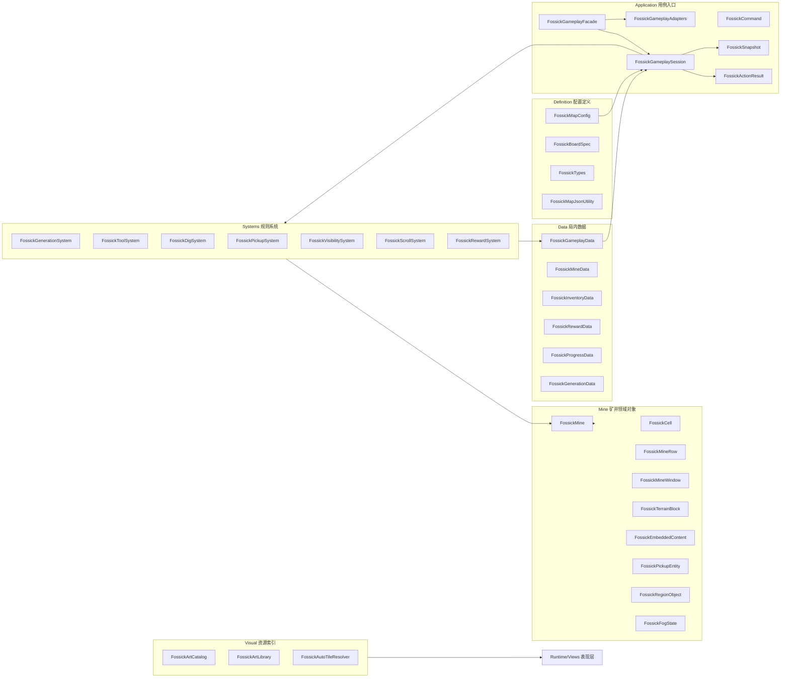
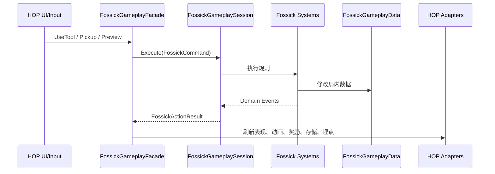
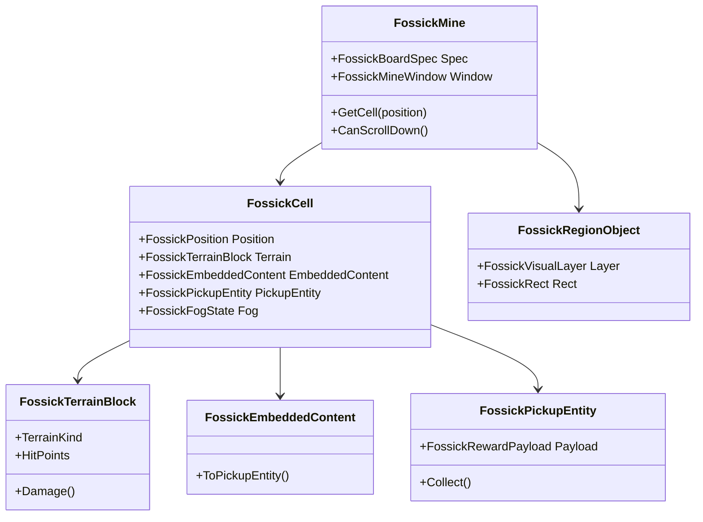

# Fossick Core 架构说明

本文描述当前 Fossick Core 的正式结构，用于迁移到 HOP 前统一理解。这里不再保留阶段性版本命名，Core 只表达当前应长期维护的玩法模型。

可视化架构图请打开：

`Assets/Fossick/Docs/FossickCoreArchitecturePreview.html`

## 设计目标

Fossick Core 负责矿井玩法的纯逻辑：

- 按模板和生成规则无限向下生成矿井。
- 处理挖掘、道具、阴影、掉落物、拾取、下移和统计。
- 持有可持久化的局内数据。
- 对表现层输出清晰的结果和事件。

Core 不负责：

- Unity 场景和 MonoBehaviour 生命周期。
- UI 动画、飞奖励、音效、粒子。
- HOP 的账号、活动生命周期、正式发奖、埋点和存储实现。

这些由 HOP 侧通过 adapter 接入。

## 总体结构



## 目录边界

```text
Assets/Fossick/Core/
  Application/   Gameplay 入口、Command、Result、Snapshot、Adapter 接口
  Data/          局内可持久化数据
  Definition/    地图配置、基础类型、JSON 序列化
  Generation/    模板抽取、随机种子、矿井拼接算法
  Mine/          矿井领域对象、格子、行、窗口、地形、奖励实体、区域、阴影
  Systems/       挖掘、道具、拾取、视野、下移、奖励、生成规则系统
  Visual/        美术资源 Catalog 和四方连续查询
```

`MapStudio`、`Runtime`、`Preview` 都可以依赖 `Core`。`Core` 不反向依赖这些模块。

## Application 主线

外部调用只推荐走 `FossickGameplaySession` 或 `FossickGameplayFacade`。



## Command 和 System 的职责边界

`FossickCommand` 是玩家或外部系统发起的一次意图，例如：

- `FossickUseToolCommand`
- `FossickPickupCommand`
- `FossickPreviewCommand`

`System` 是规则执行者，例如：

- `FossickToolSystem`：判断道具能否使用、计算目标范围。
- `FossickDigSystem`：处理地形受击、破坏、嵌入内容露出。
- `FossickPickupSystem`：处理掉落实体拾取。
- `FossickVisibilitySystem`：处理阴影揭示和自然连通视野。
- `FossickScrollSystem`：处理矿井下移。
- `FossickRewardSystem`：把奖励 payload 入账到数据。
- `FossickGenerationSystem`：按规则追加和修剪矿井行。

Command 不直接修改矿井；Session 负责把 Command 编排给对应 System。

## 地图对象模型



核心口径：

- 地形是可以被挖掘或阻挡的对象。
- 矿石、金币、道具、宝箱、收藏品可以作为嵌入内容埋在地形上。
- 地形被破坏后，嵌入内容生成对应的实体。
- 实体被点击收集，不消耗矿镐、雷管、炸药或雷达。
- 阴影是独立覆盖层，不是地形。

## 运行时表现接入

迁移到 HOP 时，正式表现层需要包含：

```text
Assets/Fossick/Runtime/Views
Assets/Fossick/Runtime/Prefabs
Assets/Fossick/Resources/FossickArt
```

`Runtime/Views` 是矿井棋盘的正式表现基础，不是 Demo 壳。它负责：

- 按 `FossickSnapshot` 或当前矿井数据刷新格子。
- 使用 `FossickArtCatalog` 显示地形、阴影、奖励、装饰、区域背景。
- 支持四方连续。
- 给 HOP 后续动画系统预留挂点。

`Preview` 只用于独立试玩验证，不是 HOP 正式 UI。
